<p align="center">
  
</p>

<p align="center">
  An AI tactical intelligence assistant for professional Romanian Superliga football coaches.
</p>

<p align="center">
  
  
  
  
  
</p>

<p align="center">
  <b>Live demo:</b> decommissioned post-defence (AWS backend torn down to stop billing),
  see the <a href="#architecture">architecture</a> and the <a href="#screenshots">screenshots</a>
  below for a look at the running app.
</p>

<p align="center">
  <b>Thesis:</b> <a href="docs/UmbraRo-Thesis.pdf">Read the full bachelor thesis (PDF)</a>
</p>

---

## Table of Contents

- [Overview](#overview)
- [Thesis](#thesis)
- [Architecture](#architecture)
- [Features](#features)
- [Screenshots](#screenshots)
- [Machine learning](#machine-learning)
- [Tech stack](#tech-stack)
- [Project structure](#project-structure)
- [Getting started (local)](#getting-started-local)
- [Deployment](#deployment)
- [Authentication](#authentication)
- [Design system](#design-system)
- [License](#license)
- [Author](#author)

## Overview

UmbraRo operationalises a Babes-Bolyai University bachelor thesis into a deployed product. It turns
predictive match analytics into prescriptive tactical guidance for coaching staff, answering not only
what is likely to happen but also what the staff should do to improve the outcome. The system runs as
a single cross-platform Flutter client backed by a Python FastAPI service, fully hosted on AWS.

The intelligence pipeline has four stages:

1. **Predict.** A calibrated CatBoost classifier estimates the binary home-win probability of a
   fixture (Home Win versus Not Home Win).
2. **Explain.** SHAP attributions surface the strongest positive drivers and the strongest negative
   risks behind that probability.
3. **Prescribe.** A constrained Monte Carlo optimiser searches thousands of realistic tactical
   permutations and returns a feasible tactical blueprint that raises the win probability, reported
   with the measured uplift.
4. **Select.** A separate supervised model predicts each club's likely starting eleven, combining
   per-90 player metrics, availability, an opponent-style profile, and a Hungarian assignment to fill
   the formation.

## Thesis

UmbraRo is the deployed artefact of the bachelor thesis *UmbraRo: From Match Forecasting to Tactical
Prescription and Lineup Selection for the Romanian Superliga*, submitted to the Faculty of Mathematics
and Computer Science, Babes-Bolyai University Cluj-Napoca, under the supervision of Assist. PhD. Briciu
Anamaria.

The thesis develops the full predictive-to-prescriptive pipeline, the constrained Monte Carlo tactical
optimiser, and the player-level Starting XI predictor, and reports their evaluation on 1,600 Romanian
Superliga matches across five seasons, from 2020-2021 to 2024-2025.

- **Read the thesis:** [docs/UmbraRo-Thesis.pdf](docs/UmbraRo-Thesis.pdf)
- **Defence slides:** [docs/UmbraRo-Presentation.pptx](docs/UmbraRo-Presentation.pptx)
- **Reproducible analysis:** the canonical numbers come from the notebooks in
  [`data/`](data/) (`TheNotebook.ipynb` for the team-level pipeline, `TheXIBook.ipynb` for the
  Starting XI layer).
- **Diagram sources:** the thesis figures (ER schema, sequence) are kept render-ready in
  [`design/diagrams/`](design/diagrams/).

## Architecture

<p align="center">
  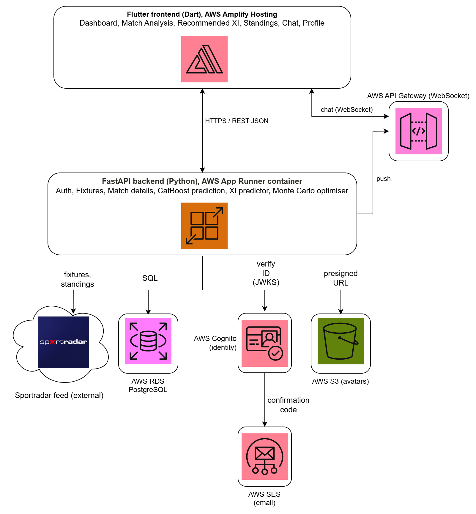
</p>

- **Frontend.** A Flutter app with a feature-first layout under `lib/features/` and shared
  infrastructure in `lib/core/`. State management uses `ChangeNotifier` with a repository pattern. The
  web build is hosted on AWS Amplify, and a native Android target ships as a release APK. The runtime
  API URL and Cognito identifiers are read from `web/config.json` on web, so they can change without a
  rebuild. On mobile, the same values are compiled in at build time.
- **Backend.** A layered async FastAPI service (`api/v1/endpoints/` to `services/` to `data/`),
  packaged as a Docker image in Amazon ECR and served by AWS App Runner. The machine learning bundle
  loads once at startup through a lifespan hook.
- **Data and identity.** Persistent state (users, profiles, and chat) lives in AWS RDS PostgreSQL
  through async SQLAlchemy over asyncpg. Authentication is handled by AWS Cognito, which sends the email
  verification code through its managed mailer by default, with Amazon SES configurable as the sender. Avatars use presigned Amazon S3 uploads, and instant chat fans out
  over an API Gateway WebSocket backed by a DynamoDB connections table.

System diagrams, all generated from the real system and kept render-ready in
[`design/diagrams/`](design/diagrams/):

<p align="center">
  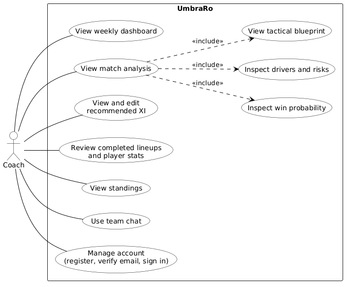
  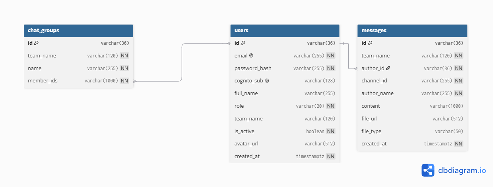
</p>
<p align="center">
  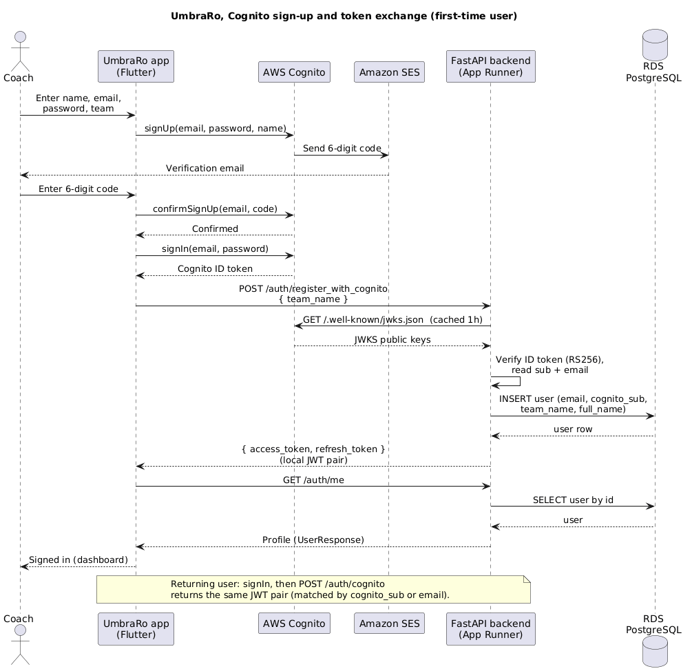
  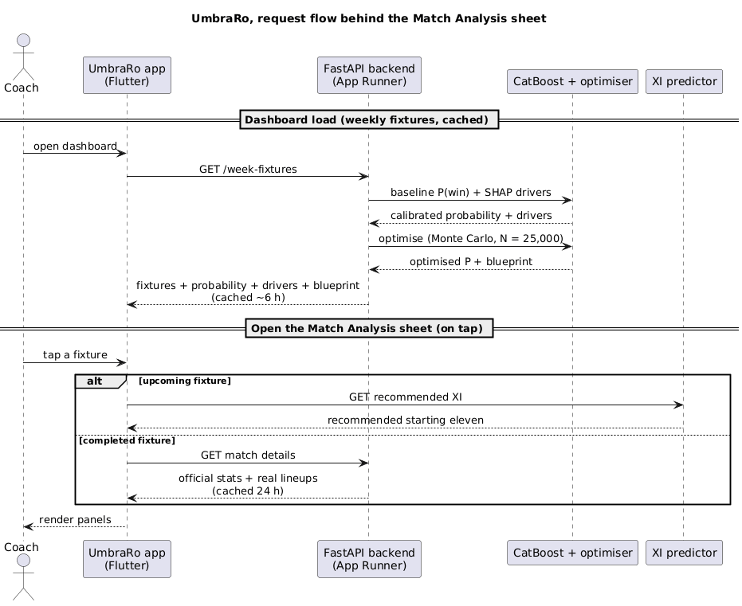
</p>

The use-case diagram covers one actor, the coaching and technical staff, and ten use cases. The database
declares no foreign keys, so `db_schema.png` shows the links (`author_id`, `member_ids`, `team_name`) as
application-level, not database-enforced.

## Features

- **Win probability**, shown as the probability of a home win in the binary formulation.
- **Key drivers**, the top positive contributions and the top risks behind the current probability.
- **Tactical blueprint**, the optimiser's recommended target values for possession, shots, shots on
  target, and corners, together with the baseline probability, the optimised probability, and the
  uplift.
- **Starting eleven prediction** for each club, with availability and opponent context.
- **Standings** in an editorial, premium league table.
- **Command chat**, a direct, operational tactical interface rather than a social messenger.

## Screenshots

#### Dashboard

The user's club next fixture with its calibrated win probability and verdict tag, above the week's
remaining fixtures.

<p align="center">
  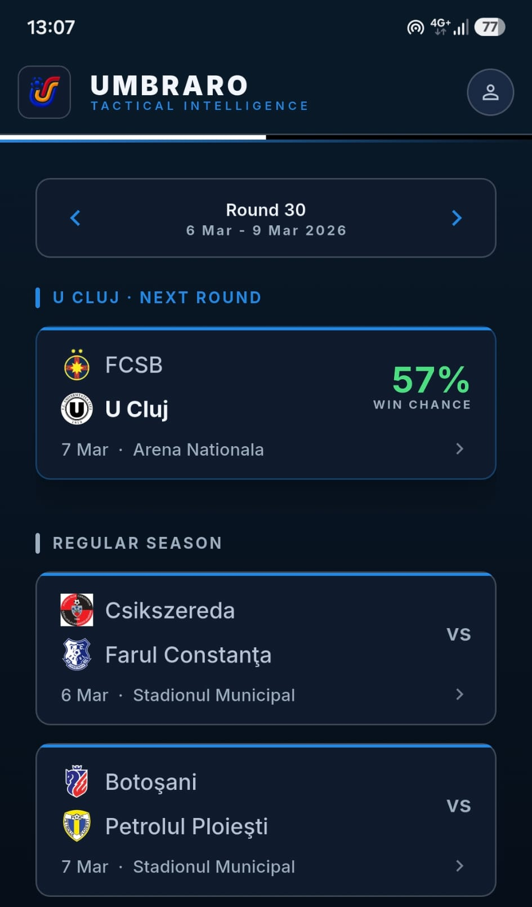
</p>

#### Match Analysis, upcoming fixture

FCSB vs. Universitatea Cluj: win chance, verdict, and key drivers, then the optimal tactical plan and
levers above the recommended XI.

<p align="center">
  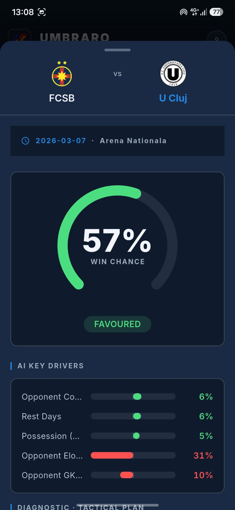
  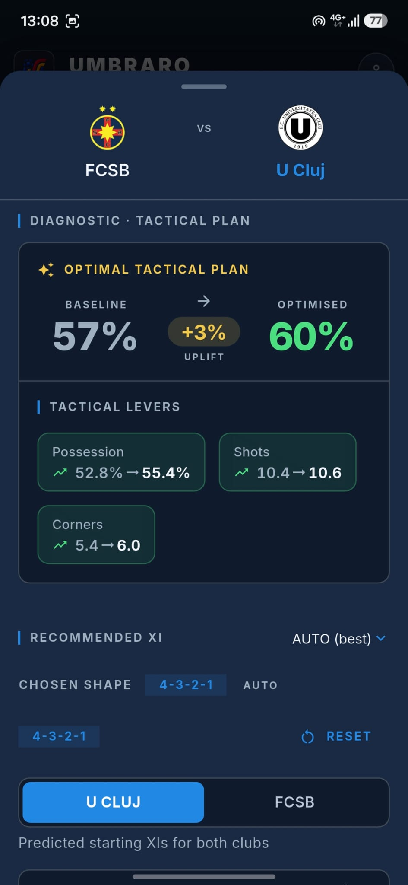
</p>

#### Match Analysis, completed fixture

Universitatea Cluj vs. Oțelul Galați: the official statistics, and the real starting eleven with
substitution minutes and goal indicators.

<p align="center">
  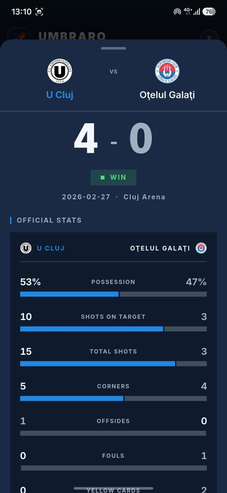
  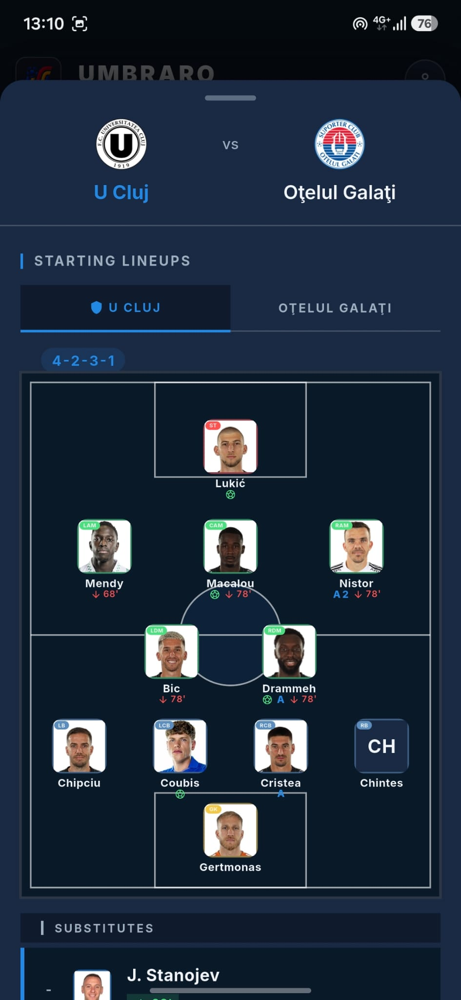
</p>

#### Starting XI / lineup pitch

The recommended starting eleven, each chip showing the player's position, rating, and selection score,
and a per-player detail sheet with a within-position percentile radar and physical-state panel.

<p align="center">
  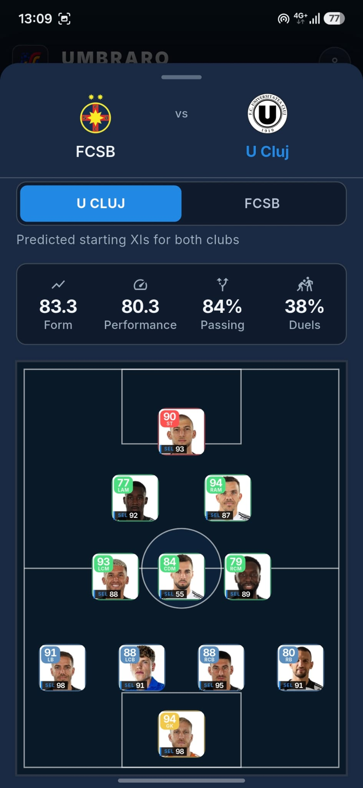
  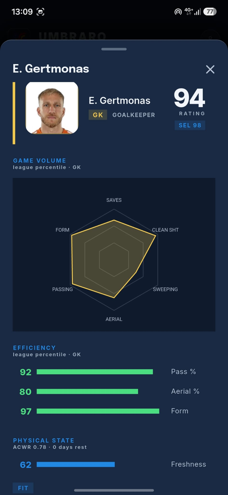
</p>

#### Standings

The Superliga table with the user's club lifted into a highlighted header card showing rank, points,
goal difference, and record.

<p align="center">
  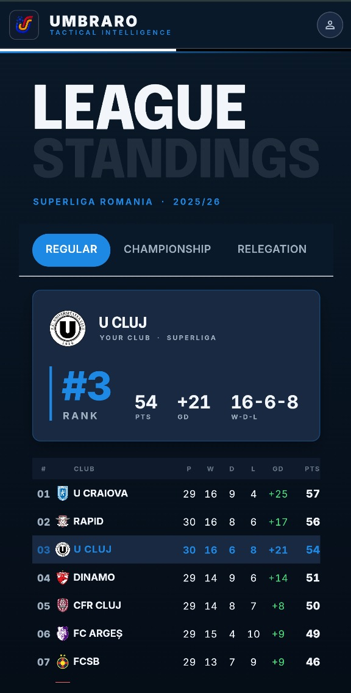
</p>

#### Team chat

The club's general channel, with the group-creation control and the message composer.

<p align="center">
  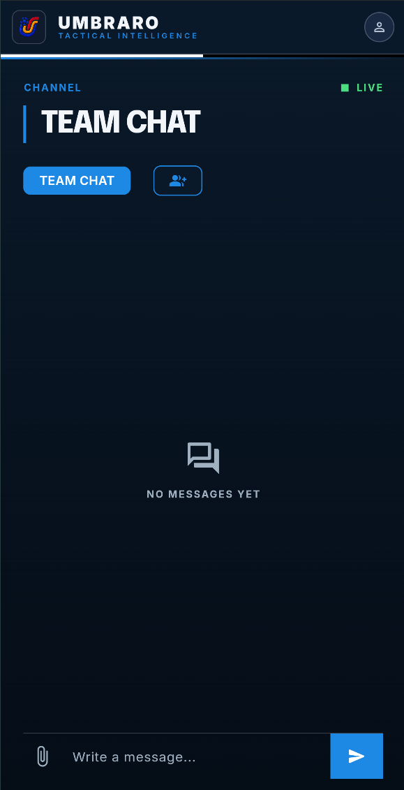
</p>

## Machine learning

The model is trained on 1,600 Romanian Superliga matches across five seasons, from 2020-2021 to
2024-2025. Seven classifiers were benchmarked, and a central finding of the thesis is that predictive
accuracy and prescriptive usefulness are distinct criteria.

### Model comparison

| Model | Accuracy | Brier score | ROC-AUC | ECE |
|---|---|---|---|---|
| Elo-only baseline (1 feature) | 65.20% | 0.2241 | 0.6699 | - |
| Logistic Regression (best engineered model) | 64.89% | 0.2256 | 0.6669 | 0.0529 |
| **CatBoost (deployed, calibrated)** | 62.95% | 0.2329 | 0.6350 | 0.0517 |

I carried forward only two of the seven benchmarked classifiers to this table. Naive Bayes and XGBoost
were the weakest, the SVM gives a distance from its decision boundary rather than a probability, which
everything downstream needs, the Multi-Layer Perceptron was the least stable across random seeds, and
Random Forest is redundant with CatBoost's own tree-ensemble family, which additionally handles missing
values natively. That leaves Logistic Regression, the most accurate, and CatBoost (300 iterations,
depth 3, learning rate 0.02, Platt-sigmoid calibration over a 3-fold rolling-origin split), the one I
actually deploy.

A one-feature Elo-only baseline already reaches 65.20% accuracy, a figure no engineered model surpasses,
so I won't pretend the extra features predict more winners. Logistic Regression is the most accurate of
the engineered models, yet inside the optimiser it concentrates almost its entire response in a single
tactical lever: raising shots to the 95th percentile alone moves its predicted win probability by about
17 percentage points. I deploy CatBoost instead: marginally less accurate, but far better distributed.
The same sweep moves its prediction by 6.7, 5.6, 5.2, and 2.8 percentage points for possession, shots,
shots on target, and corners respectively, so a recommendation never collapses onto a single lever,
exactly the spread this sensitivity sweep shows:

<p align="center">
  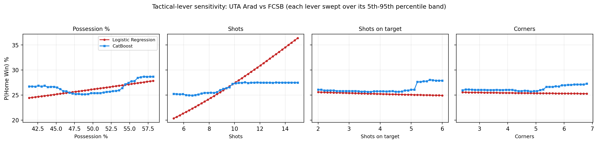
</p>

Logistic Regression stays as an interpretable forecasting benchmark. Since the added features do not
raise raw accuracy above the Elo baseline, they earn their place through calibration, explanation, and
prescription instead, reflected in how closely the calibrated probabilities track real outcomes:

<p align="center">
  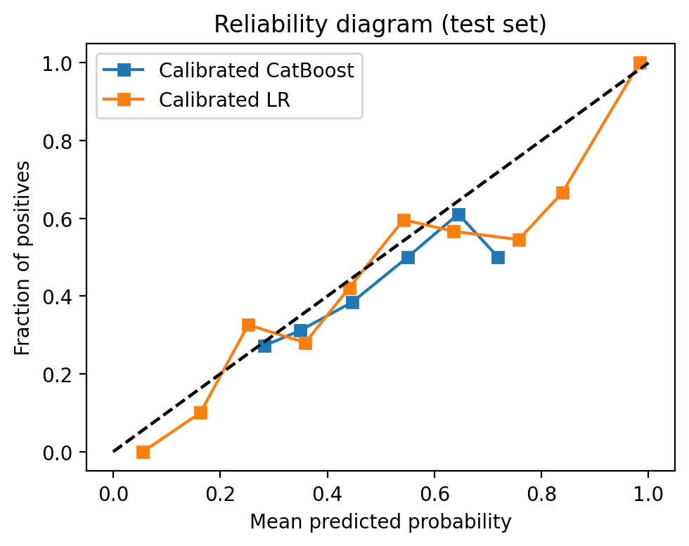
</p>

> The most accurate model is not always the most useful one.

**Supported inputs** (rolling five-match aggregates and pre-match context): Elo difference,
head-to-head record, rest days, possession, shots, shots on target, corners, goals scored, and goals
conceded.

### Prescriptive optimiser

A constrained Monte Carlo search (N = 25,000) explores four controllable levers (possession, shots,
shots on target, and corners), each bounded to its 5th to 95th percentile training range plus two ratio
constraints (shots on target between 20% and 70% of shots, corners between 15% and 80% of shots), while
goals scored and conceded stay frozen at their real pre-match values.

Getting here took three tries. I first averaged the tactical stats of teams that had previously beaten
the same opponent, too rigid. Then I moved one lever at a time, but that gives unrealistic plans, since
in football the levers move together. Then I hand-built tactical styles like pressing or
counter-attacking, but those just baked in my own assumptions.

On representative fixtures the optimiser raises the estimated win probability by about 13.6 percentage
points on average. A retrospective check on the holdout season shows fixtures that hit the blueprint won
more often than the rest, but that's a correlation, not proof: strong teams tend to both follow good
plans and win, so a proper causal test is left as future work:

<p align="center">
  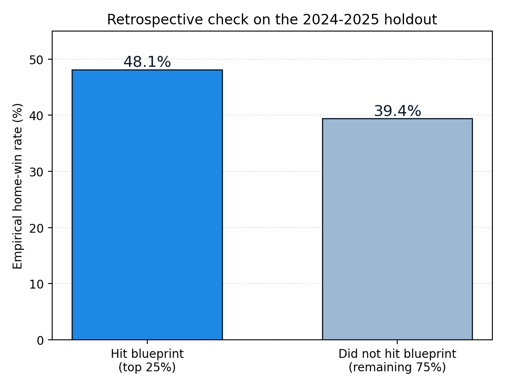
</p>

### Starting XI selection

Player data was provided by FC Universitatea Cluj, whose sporting director shared the per-match
statistics that power this layer. A separate model, trained on a 278-match, 16-club Wyscout dataset from
the Romanian Superliga (556 fixtures, 15,396 pooled player-fixture rows), combines per-90 performance
normalisation and empirical-Bayes shrinkage with a pooled logistic-regression classifier that outputs
each player's probability of starting. The eleven starters are then placed by the Hungarian algorithm.
Filling each slot greedily, one after another, is like seating a wedding: put the first guest in the
best seat, the bride's, and you wreck the whole table. The Hungarian algorithm solves the whole board at
once instead, for any formation.

Under a strict rolling-origin, one-fixture-out validation across 428 held-out fixtures it reaches a
league-wide Jaccard@11 of 0.6227 (NDCG@11 0.8107), beating a top-by-minutes baseline (0.520) by 0.103
absolute.

A separate ablation decomposes the model's own result honestly: of the 0.175 gap between this classifier
and a hand-weighted heuristic composite (0.4476), 0.072 comes from the learned classifier architecture
itself, and the remaining 0.103 comes from availability and recency signals that are, by the thesis's
own account, partly autoregressive on the coach's past selection decisions rather than pure player
evaluation.

### What the model does not use

UmbraRo is a coaching tool, not a betting tool. To keep every output grounded in the training data and
in that intent, it does not include biometrics, GPS or wearable tracking, player-level running load,
expected-threat pipelines, passing-network models, three-way home/draw/away classification, or any
betting-odds framing.

## Tech stack

| Layer | Technology |
|---|---|
| Client | Flutter (Dart), `ChangeNotifier` + repository pattern, Amplify Auth |
| Backend | FastAPI (async Python 3.11+), SQLAlchemy over asyncpg |
| Machine learning | CatBoost, SHAP, constrained Monte Carlo optimisation |
| Identity | AWS Cognito (managed email by default, Amazon SES configurable), short-lived local JWT |
| Hosting | AWS Amplify Hosting (web), AWS App Runner and Amazon ECR (backend) |
| Data | AWS RDS PostgreSQL, Amazon S3, API Gateway WebSocket and DynamoDB |

## Project structure

```text
lib/            Flutter client (feature-first under features/, shared core/)
backend/        FastAPI service: api/v1/endpoints, services, data loaders, ml bundle
android/        Native Android target (release APK)
web/            Web entrypoint and runtime config.json
data/           Research dataset and notebooks (canonical thesis numbers)
design/         Design system, product specification, and diagram sources
docs/           Final bachelor thesis (PDF)
infra/          Infrastructure templates (Cognito, WebSocket, Lambdas)
scripts/        Developer and data-pipeline utilities
```

## Getting started (local)

### Backend

```bash
cd backend
python -m venv .venv
.venv\Scripts\activate          # Windows, use source .venv/bin/activate on macOS or Linux
pip install -r requirements.txt
cp .env.example .env            # then set JWT_SECRET, DATABASE_URL, and the COGNITO_* values
uvicorn app.main:app --reload --host 127.0.0.1 --port 8000
```

The committed `.env.example` defaults `DATABASE_URL` to a local SQLite file, so the backend runs with
no external services. Point it at the PostgreSQL URL to mirror production.

### Flutter (web)

```bash
flutter pub get
flutter run -d chrome --web-port 8080 \
  --dart-define=APP_ENV=development \
  --dart-define=API_BASE_URL=http://127.0.0.1:8000/api/v1
```

### Android (release APK)

Because `web/config.json` is read only on web, a mobile build must bake the production values in at
build time:

```bash
flutter build apk --release \
  --dart-define=APP_ENV=production \
  --dart-define=API_BASE_URL=https://<app-runner-host>/api/v1 \
  --dart-define=COGNITO_USER_POOL_ID=<pool-id> \
  --dart-define=COGNITO_APP_CLIENT_ID=<app-client-id>
```

### Tests

```bash
flutter test
flutter drive --target=integration_test/app_test.dart
```

## Deployment

- **Frontend.** Pushing to the `umbraro` branch triggers AWS Amplify Hosting, which builds the Flutter
  web app and serves it.
- **Backend.** A GitHub Actions workflow builds the Docker image, pushes it to Amazon ECR, and starts
  an AWS App Runner deployment.

## Authentication

Sign-up and sign-in go through AWS Cognito using Amplify. On first sign-up the client requests a
six-digit confirmation code, which Cognito delivers through its managed mailer by default (Amazon SES
can be configured as the sender). An account that has not
confirmed its email cannot sign in. After confirmation the client exchanges the Cognito ID token for a
short-lived local JWT bound to the Cognito subject, and subsequent API calls present that JWT. A local
email and password path remains available as a fallback when no Cognito pool is configured.

## Design system

The visual language is "The Stoic Analyst": a severe, editorial, data-minimalist aesthetic built for
elite coaching staff. It uses a deep navy surface (`#0A1929`), a cobalt accent (`#1E88E5`), and
off-white text (`#F2F6FB`), the Epilogue and Inter typefaces, sharp corners with zero border radius,
and depth through tonal layering rather than gradients, glows, or shadows.

## License

Released under the MIT License. See [LICENSE](LICENSE).

## Author

Built by Mihai Ciorascu as a bachelor thesis at Babes-Bolyai University, under the supervision of
Assist. PhD. Briciu Anamaria.
